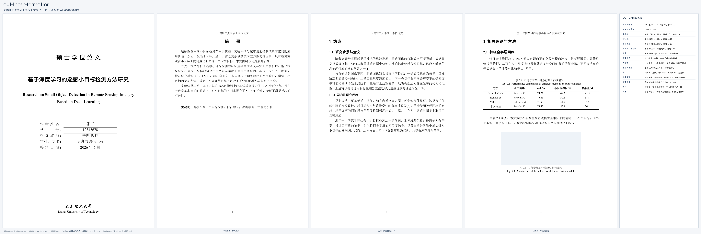

# dut-thesis-formatter

把中文论文草稿的 `.docx` **就地改写**为符合《大连理工大学硕士学位论文格式规范》的成品。
也可从零生成符合规范的论文骨架，或对任意 `.docx` 做格式体检。

本 skill 借助 DeepSeek Flash 生成，并参考了 @Gorilla-Kevv/scnu-thesis-formatter 项目。



> 上图是 **Word 真实渲染结果**（不是示意图）：封面、中文摘要、正文首页、含三线表的正文页，
> 右侧为关键规范值。生成流程：`scripts/make_demo.py` 造示例 → `scripts/convert_with_word.sh`
> 调 Word 转 PDF → `scripts/make_demo_real.py` 合成图。实测字号见图片底部。

## 它能做什么

| 内容 | 说明 |
|---|---|
| 页面与分节 | A4；上 3.5 / 下 2.5 / 左 2.5 / 右 2.5 cm，页眉 2.5 cm，页脚 2.0 cm；自动补出「封面 / 前置 / 正文」分节 |
| 封面 | 「硕 士 学 位 论 文」（华文细黑 24pt）+ 中英文题目 + 字段块，封面无页码 |
| 摘要 | 「摘　　要」小三黑体居中；正文小四宋体、1.25 倍行距；「关键词：」黑体小四，`；` 分隔 |
| 英文摘要 | `ABSTRACT` + `Key Words：`（加粗），Times New Roman |
| 目录 | 自动目录域 `TOC \o "1-3" \h \z \u` + `updateFields`；另提供图目录 / 表目录域 |
| 三级标题 | 章 黑体三号居左（段后 1 行、另起一页）；节 黑体四号；小节 黑体小四（段前 0.5 行） |
| 正文 | 宋体小四，两端对齐，**1.25 倍行距**，首行缩进 2 字符，取消「对齐到网格」 |
| 三线表 | 上线 / 下线 1.5pt、表头线 1pt、无竖线；表内五号居中；表题在表上方（中英两行） |
| 图 | 居中 + 图题在图下方（宋体五号中文 + Times New Roman 五号英文），分章编号 |
| 公式 | 居中制表位 + 行末右对齐编号，段前段后 6pt |
| 参考文献 | 标题小三黑体居中；条目五号宋体 + 悬挂缩进；GB/T 7714；**按正文引用顺序重排、自动删除未引用条目** |
| 引用标注 | 正文 `[1]` / `[2-4]` 转成右上角标 |
| 页眉页脚 | 奇偶页不同页眉（校名 / 论文题目）；页脚页码 `- n -`；前置罗马数字、正文阿拉伯从 1 起 |
| 附录 / 致谢 / 成果 | 小三黑体居中标题 + 小四正文 |
| 校验 | `audit()` 输出问题清单：页面、域、标题层级、字体、缩进、三线表、页眉文案 |

## 安装

这是一个遵循 `SKILL.md` + YAML frontmatter 约定的 Agent Skill，适用于
**Claude Code、DeepSeek Harness（DSH）**以及其它支持该约定的 Agent 工具。
详见 [`docs/INSTALL.md`](docs/INSTALL.md)。

### 方式一：让 Agent 自己装（推荐）

最简单——把下面整段贴给你的 Agent，它会自己找技能目录、克隆、装依赖并自检：

````text
请帮我安装一个 Agent Skill：

仓库：https://github.com/chen-xing512/DUT-thesis-formatter.git
技能名：dut-thesis-formatter

要求：
1. 找到本 Agent 工具的技能目录（skills 目录）。若无法确定，
   先把探测到的候选路径列给我确认，不要自己猜着写。
   常见约定：Claude Code → ~/.claude/skills/
             Codex → $CODEX_HOME/skills/（默认 ~/.codex/skills/）
             DeepSeek Harness → $DSH_HOME/skills/（默认 ~/.dsh/skills/）
             项目级 → <项目根>/.claude/skills/ 或 <项目根>/.dsh/skills/
2. 把仓库克隆到技能目录，目录名必须是 dut-thesis-formatter
   （要与 SKILL.md 里 frontmatter 的 name 一致，否则可能加载不到）。
   已存在同名目录时先告诉我，不要直接覆盖。
3. 确认技能目录里有 SKILL.md，frontmatter 的 name / description 完整。
4. 检查 python-docx 是否已安装；缺的话装到本 Agent 实际使用的解释器里。
5. 用这份最小代码自检并报告输出：
       from docx import Document
       from dut_thesis import reformat, audit, print_report
6. 最后告诉我：装到了哪个绝对路径、依赖是否就绪、是否需要重启会话生效。
````

这样写是有原因的，几个容易踩的点都在提示词里约束住了：

- **技能名要对齐 frontmatter** —— 克隆出的目录名若与 `SKILL.md` 里的 `name:` 不一致，
  有的工具会加载不到；
- **别让 Agent 猜目录** —— 各工具约定不同、还可能读环境变量（如 DSH 的 `$DSH_HOME`），
  所以要求"不确定就先问"；
- **别直接覆盖** —— 避免误删已有同名技能；
- **装完要自检** —— 确认 `SKILL.md` 与 `dut_thesis.py` 真能导入。

### 方式二：自己克隆（通用）

先确认你的工具用哪个技能目录：

| 工具 | 用户级技能目录 | 项目级 |
|---|---|---|
| Claude Code | `~/.claude/skills/` | `<项目>/.claude/skills/` |
| Codex | `$CODEX_HOME/skills/` | 用用户级 |
| DeepSeek Harness | `$DSH_HOME/skills/` | `<项目>/.dsh/skills/` |
| 其它工具 | 查该工具的 skills / extensions 配置 | 同上 |

> `$CODEX_HOME` 默认 `~/.codex`，`$DSH_HOME` 默认 `~/.dsh`。
> 也就是说 Codex 默认是 `~/.codex/skills/`，DSH 默认是 `~/.dsh/skills/`。

```bash
# 把 <技能目录> 换成上表对应的一列
git clone https://github.com/chen-xing512/DUT-thesis-formatter.git \
  <技能目录>/dut-thesis-formatter

# 例：Claude Code 用户级
git clone https://github.com/chen-xing512/DUT-thesis-formatter.git \
  ~/.claude/skills/dut-thesis-formatter

# 例：Codex 用户级
git clone https://github.com/chen-xing512/DUT-thesis-formatter.git \
  ~/.codex/skills/dut-thesis-formatter
```

#### Codex 补充说明

Codex 会扫描 `$CODEX_HOME/skills/<技能名>/SKILL.md`，所以上面这条 `git clone`
就是完整安装步骤，克隆完**下一轮对话即可用**。

Codex 自带 `skill-installer`，但它的 `--path` 只接受**仓库内的子目录**
（`--path .` 会报 `Invalid skill name`）。本仓库的 `SKILL.md` 在**仓库根目录**，
因此无法直接喂给它；用 `git clone` 即可。若你的 Codex 版本支持子目录形态，
也可以 `--path dut-thesis-formatter`，但需仓库把技能放进同名子目录。

装完确认：

```bash
ls <技能目录>/dut-thesis-formatter/SKILL.md
```

支持 `SKILL.md` + frontmatter 的工具会**自动发现**该技能，无需手动点名——
触发条件写在 `SKILL.md` 的 `description` 里。

### 方式三：打包成 `.skill` 再导入

适合只接受压缩包导入的工具，或需要离线分发时：

```bash
git clone https://github.com/chen-xing512/DUT-thesis-formatter.git
cd dut-thesis-formatter
python scripts/package_skill.py     # 生成 dist/dut-thesis-formatter.skill
```

仓库打 `v*` 标签时，GitHub Actions 会自动跑测试、打包并发布到
[Releases](https://github.com/chen-xing512/DUT-thesis-formatter/releases)，
也可以直接下载。

### 渲染成 PDF / 效果图（可选）

要把排版好的 `.docx` 变成 PDF，**在系统终端里**（不是 Agent 沙箱内）跑：

```bash
./scripts/convert_with_word.sh 论文_DUT.docx        # 用本机 Microsoft Word
```

沙箱内跑会失败：携带 AppleEvent 的操作被拦，`osascript` 返回 `-10004`，
且**不会弹出** macOS 授权框——详见 [`docs/RENDERING.md`](docs/RENDERING.md)（含实测对照表）。
装了 LibreOffice 的话更简单，且沙箱内外都能用：

```bash
soffice --headless --convert-to pdf --outdir . 论文_DUT.docx
```

## 依赖

```bash
pip install python-docx
```

**Python ≥ 3.9**（已在 3.9 与 3.12 上实测通过；CI 用 3.11）。

`python-docx` 是**唯一**必需依赖。生成 `docs/demo.png` 才需要 matplotlib：

```bash
pip install matplotlib
python scripts/make_demo.py
```

## 使用

### 交给 Agent（推荐）

直接给一份 `.docx` 并说明意图即可，例如：

- 「把这份论文草稿按大连理工大学硕士学位论文格式规范排版：`论文.docx`」
- 「严格按研究生院的学位论文模板修改订正这份 docx，页眉页码目录都要对」
- 「帮我检查这篇论文哪里不符合大工硕士论文格式要求」
- 「新建一份大连理工大学硕士论文的 Word 骨架，题目是……」

### 命令行

```bash
# 1) 改写成 DUT 格式（--title 是论文中文题目，用于偶数页页眉）
python scripts/cli.py reformat 论文.docx -o 论文_DUT.docx --title "基于XX的YY研究"

# 2) 只体检，不改文件（有问题时退出码为 1）
python scripts/cli.py audit 论文_DUT.docx

# 3) 从零生成符合规范的骨架
python scripts/cli.py template 论文骨架.docx --title "题目" --author 张三 --sid 12345678
```

### 作为 Python 库

```python
from docx import Document
from dut_thesis import reformat, audit, print_report, enable_update_fields

doc = Document('论文.docx')
stats = reformat(doc, title_cn='基于XX的YY研究')
print_report(stats)
enable_update_fields(doc)
doc.save('论文_DUT.docx')

print_report(audit(Document('论文_DUT.docx')))    # 交付前必做
```

## 目录结构

```
dut-thesis-formatter/
├── SKILL.md                          # 技能定义 + 工作流 + 质量自检清单
├── README.md
├── install-prompt.txt                # 「让 Agent 自己装」那段提示词，可直接复制
├── LICENSE
├── references/
│   └── dut-format-rules.md           # 硬编码的 DUT 格式规范（唯一事实来源）
├── scripts/
│   ├── dut_thesis.py                 # 核心库：python-docx 全部排版函数 + reformat/audit
│   ├── cli.py                        # 命令行：reformat / audit / template
│   ├── convert_with_word.sh          # 用 Word 把 docx 转 PDF（须在沙箱外运行）
│   ├── make_demo.py                  # 生成规格示意面板
│   ├── make_showcase.py              # 造内容完整的示例论文（11 页）
│   ├── make_demo_real.py             # 把渲染出的 PDF 合成 docs/demo.png
│   ├── package_skill.py              # 打包 .skill（CI 也用它）
│   └── tests/test_smoke.py           # 端到端冒烟测试：生成 → 改写 → 校验
├── docs/
│   ├── demo.png                      # 真实渲染的效果图
│   ├── INSTALL.md                    # 安装指南（三种方式 + 各工具技能目录）
│   └── RENDERING.md                  # 渲染成 PDF/图片的三种路径与排错
└── .github/workflows/release.yml     # 打 v* 标签 → 跑测试 → 打包并发布 Release
```

## 规范来源与优先级

本 skill 借助 DeepSeek Flash 生成，并参考了 [Gorilla-Kevv/scnu-thesis-formatter](https://github.com/Gorilla-Kevv/scnu-thesis-formatter) 项目。

规则提炼自大连理工大学研究生院《大连理工大学硕士学位论文格式规范》（2026-04-15 版），
并交叉核对了官方 Word 模板的样式定义（`摘要题目` / `图名中文` / `参考文献正文` / `公式` 等
自定义样式的 `w:rFonts`、`w:sz`、`w:spacing`、`w:outlineLvl` 属性）与 LaTeX 模板
`DUT-thesis-grd.cls`。三者冲突时：

1. **规范 docx 正文说明**（权威）
2. LaTeX 模板 `.cls`（旁证——其左边距 2.7 cm、章标题三号与 docx 不一致，以 docx 为准）

一处已知差异：官方模板文件里表头下线实际是 **0.5 磅**（`w:sz="4"`），而规范正文明确写
**1 磅**。本技能按规范正文执行（`w:sz="8"`）；需要贴合模板文件时传 `header_sz=4`。

## 测试

```bash
python scripts/tests/test_smoke.py
```

覆盖：段落分类、参考文献条目规范化、三线表线宽、三级标题字号与 `outlineLvl`、
公式制表位、TOC 域与 `updateFields`、**奇偶页页眉/页脚与页码重置规则**、
端到端改写 + 校验、CLI 骨架生成。

> 页眉页脚那组断言是**回归测试**：`doc.add_section()` 会复制前一节的
> `headerReference`/`footerReference`（两节共用同一部件），加上 python-docx
> `is_linked_to_previous` 的反直觉语义，曾导致「封面长出页眉」「偶数页页码消失」
> 且每节页码都从 1 重新开始——这些只有真实渲染才看得出来，所以用 XML 断言锁死。

## 许可

[MIT](./LICENSE)
